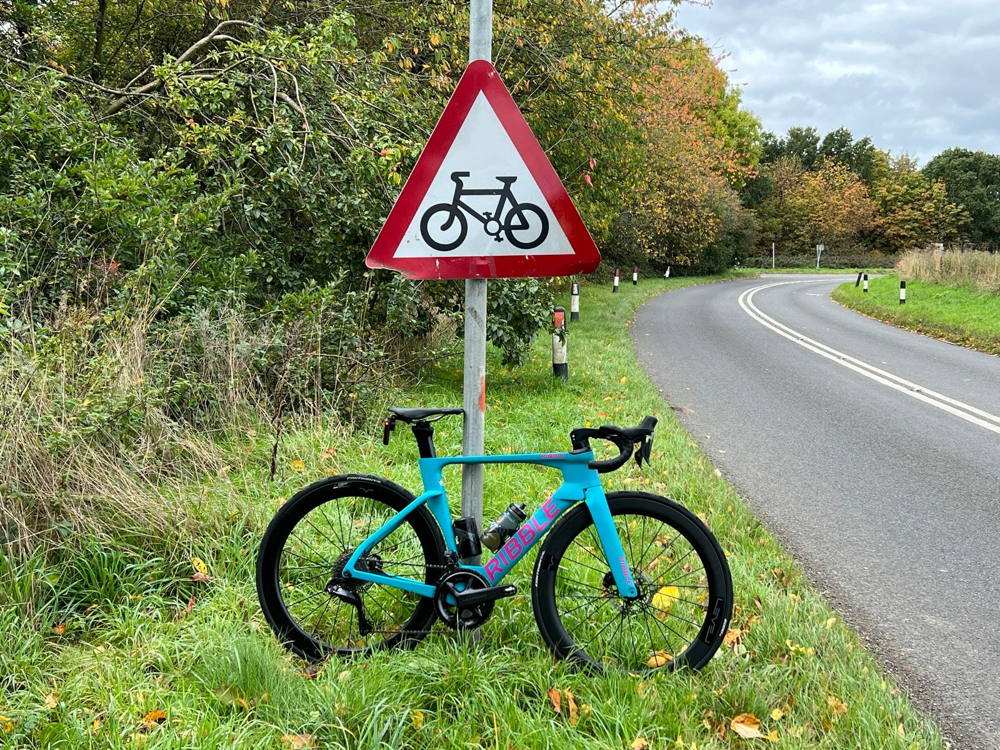

<table style="width: 100%; margin-bottom: 2rem;">
  <tr>
    <td style="width: 120px; padding-right: 1rem; vertical-align: top;">
      
    </td>
    <td style="border: 1px solid #ddd; background-color: #f9f9f9; padding: 1.5rem; border-radius: 6px;">
      <h2 style="margin-top: 0; font-size: 1.5rem;">Bicycle Noodling</h2>
      

       I have taken some .fit files from TrainerRoad workouts completed over a period of twenty months I will explore these and create visualisations using Python, PostgreSQL and Tableau.
      

    </td>
  </tr>
</table>

---

## Background

<table style="width: 100%; margin-bottom: 2rem;">
  <tr>
    <td style="width: 320px; border: 1px solid #ddd; border-radius: 6px; padding: 0.5rem;">
      
    </td>
    <td style="vertical-align: top; padding-left: 1rem;">
      <a href="/portfolio-toby-draper/background/"><strong>Terminology explained</strong></a> 
      What is a .fit file? What is FTP? All these questions answered and more, for those of us who are not obsessed about riding bicycles faster.
    </td>
  </tr>
</table>

---

## Noodling

<table style="width: 100%; margin-bottom: 2rem;">
  <tr>
    <td style="width: 320px; border: 1px solid #ddd; border-radius: 6px; padding: 0.5rem;">
      
    </td>
    <td style="vertical-align: top; padding-left: 1rem;">
      <a href="/portfolio-toby-draper/noodle_1/"><strong>1. Transform phase</strong></a> 
      Working with six .fit files downloaded from the TrainerRoad application, I use the fitparse library to extract the raw data. Each file is cleaned, validated, and transformed into a structured Pandas DataFrame. The result is a single .csv file             containing all six activities, ready for use in future analysis.
    </td>
  </tr>
</table>

---

  <a href="/portfolio-toby-draper/" style="font-size: 1rem; text-decoration: none; color: #007acc;">← Back to Home</a>

