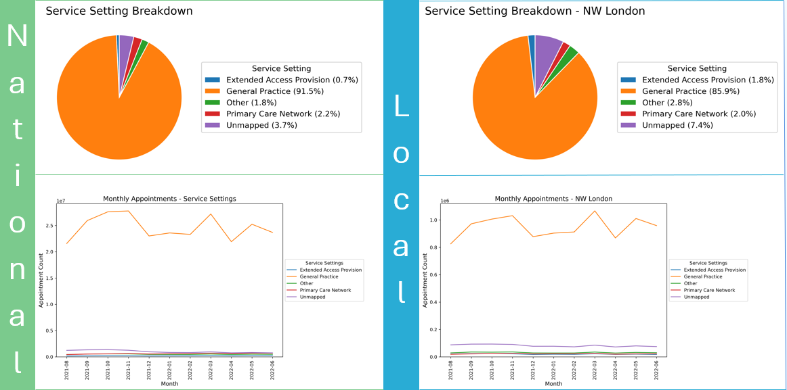

  

    
  

  

    <h2 style="margin-top: 0; font-size: 1.5rem;">My name is Toby Draper, welcome to my portfolio</h2>
    

      I am a storyteller who uses data to solve business problems through compelling, evidence-based narratives. This site is a showcase of the technical skills I am acquiring to support that work. It includes projects from the Career Accelerator programme with the London School of Economics and Political Science, where I am currently enrolled. It also features independent, personal projects that transform, explore and visualise data from sources that interest me.
    

  

## My projects

<table style="width: 100%; margin-bottom: 2rem;">
  <tr>
    <td style="width: 320px; border: 1px solid #ddd; border-radius: 6px; padding: 0.5rem;">
      
    </td>
    <td style="vertical-align: top; padding-left: 1rem;">
      <a href="/portfolio-toby-draper/course1_intro/"><strong>Retail Marketing Data Analysis</strong></a> 
     In the first LSE Career Accelerator Assignment, I analysed two data sets using MS Excel, PostgreSQL and Tableau, visualising key relationships and delivering actionable insights and recommendations.
    </td>
  </tr>
</table>
<!-- incomplete projects direct to homepage. urls to be changed when pages built -->
<table style="width: 100%; margin-bottom: 2rem;">
  <tr>
    <td style="width: 320px; border: 1px solid #ddd; border-radius: 6px; padding: 0.5rem;">
      <!-- Placeholder image for Assignment #2 -->
      
    </td>
    <td style="vertical-align: top; padding-left: 1rem;">
      <a href="/portfolio-toby-draper/"><strong>National Health Service Data Analysis</strong></a> 
      In the second LSE Career Accelerator Assignment, I explored four data sets using Python to produce visualisations designed to inform strategic decisions that shape capacity planning and optimise service delivery.
    </td>
  </tr>
</table>
<table style="width: 100%; margin-bottom: 2rem;">
  <tr>
    <td style="width: 320px; border: 1px solid #ddd; border-radius: 6px; padding: 0.5rem;">
      
    </td>
    <td style="vertical-align: top; padding-left: 1rem;">
      <a href="/portfolio-toby-draper/bicycle-noodling/"><strong>Bicycle Noodling</strong></a> 
      I downloaded .fit files, the format output from cycling and exercise apps and sensors. I transformed the files into a readable format using Python, and will continue using Python, PostgreSQL and Tableau to analyse and visualise the data over time. This may reveal insights that are not visible in popular fitness applications in the marketplace, but is more likely to reinforce just how brilliant they are compared with the tools we use in business.
    </td>
  </tr>
</table>
