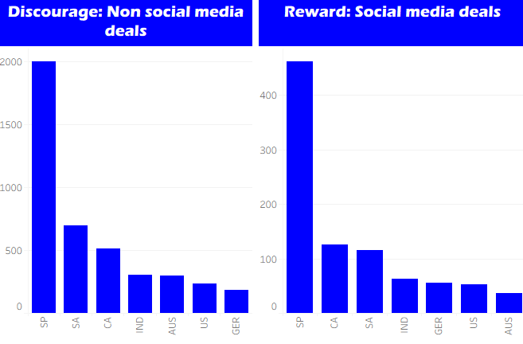

<table style="width: 100%; margin-bottom: 2rem;">
  <tr>
    <td style="width: 120px; padding-right: 1rem; vertical-align: top;">
      
    </td>
    <td style="border: 1px solid #ddd; background-color: #f9f9f9; padding: 1.5rem; border-radius: 6px;">
      <h2 style="margin-top: 0; font-size: 1.5rem;">Welcome to my showcase of data assignments and personal projects.</h2>
      

        This site features work from the Career Accelerator with the London School of Economics and Political Science, where I’m currently enrolled, alongside independent explorations in analytics, documentation, and data visualisation.
      

    </td>
  </tr>
</table>

## Projects

<table style="width: 100%; margin-bottom: 2rem;">
  <tr>
    <td style="width: 320px; border: 1px solid #ddd; border-radius: 6px; padding: 0.5rem;">
      
    </td>
    <td style="vertical-align: top; padding-left: 1rem;">
      <a href="/portfolio-toby-draper/bicycle-noodling/"><strong>Bicycle Noodling</strong></a> 
      I have taken some .fit files from TrainerRoad workouts completed historically. I will explore these and create visualisations using Python, PostgreSQL and Tableau.
    </td>
  </tr>
</table>

<table style="width: 100%; margin-bottom: 2rem;">
  <tr>
    <td style="width: 320px; border: 1px solid #ddd; border-radius: 6px; padding: 0.5rem;">
      
    </td>
    <td style="vertical-align: top; padding-left: 1rem;">
      <a href="/portfolio-toby-draper/lse-assignment-1/"><strong>LSE Assignment #1</strong></a> 
      Analysed retail marketing data with MS Excel, PostgreSQL and Tableau. Showed how social media campaigns and discount strategies drive customer return and revenue. Visualised key relationships to support actionable insights.
    </td>
  </tr>
</table>

<table style="width: 100%; margin-bottom: 2rem;">
  <tr>
    <td style="width: 320px; border: 1px solid #ddd; border-radius: 6px; padding: 0.5rem;">
      <!-- Placeholder image for Assignment #2 -->
      
    </td>
    <td style="vertical-align: top; padding-left: 1rem;">
      <a href="/portfolio-toby-draper/lse-assignment-2/"><strong>LSE Assignment #2</strong></a> 
      Describe NHS Data project here.
    </td>
  </tr>
</table>
