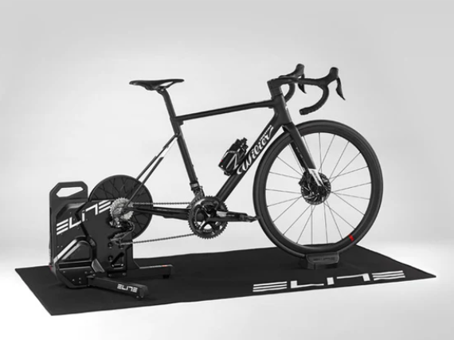

Welcome to my showcase of data assignments and personal projects.  
This site highlights hands-on analytics work, technical documentation, and exploratory data visualisations.

## Projects

  
  

    <h3><a href="https://github.com/drapertoby/bicycle-noodling">Bicycle Noodling</a></h3>
    
Exploring cycling training data using PostgressSQL, Python and Tableau.

  

- [LSE Assignment #1](lse-assignment-1.md): Used Excel, PostgreSQL, and Tableau to analyse retail marketing data and show how social media campaigns and discount strategies drive customer return and revenue. Visualised key relationships to support actionable insights.
- [LSE Assignment #2](lse-assignment-2.md): Describe NHS Data project here
